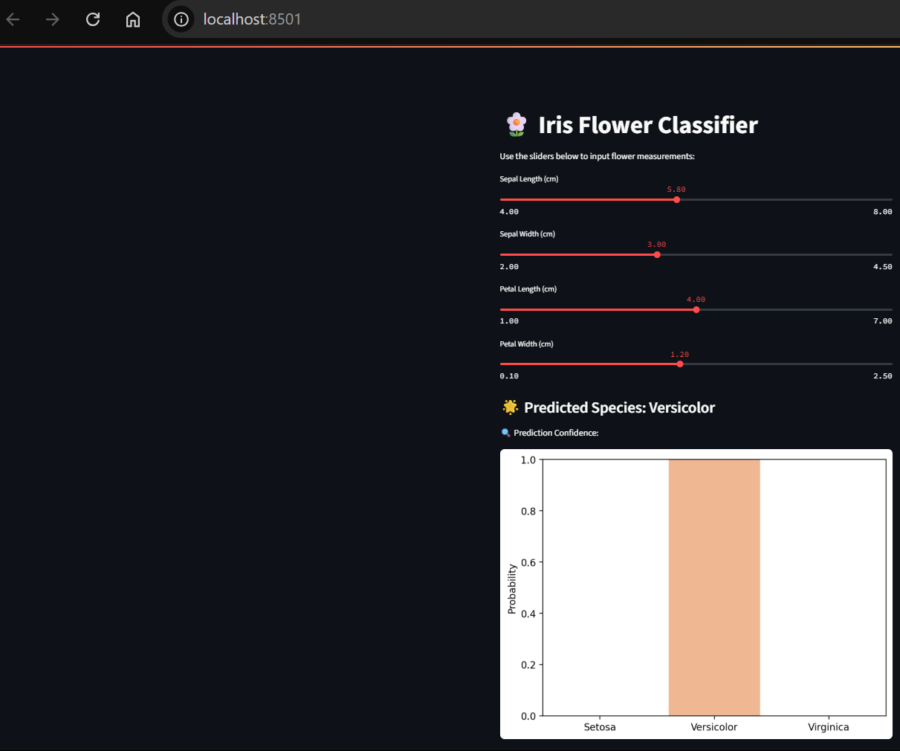

# 🌼 Iris Flower Classifier – Streamlit ML App

This project is a **web-based machine learning application** built using **Streamlit**. It utilizes a **Random Forest Classifier** trained on the classic **Iris dataset** to predict the species of a flower based on user-provided measurements.

---

## 📌 Features

- 🧠 Trained Random Forest model saved as `model.pkl`
- 🎛️ User-friendly sliders for inputting flower features
- 📈 Visual bar chart showing prediction probabilities
- 📄 Model parameter extraction into YAML and JSON formats

---

## 🗂️ Project Structure

```
Assignment_7/
├── app.py                    # Streamlit app
├── train_model.py           # Script to train and save the model
├── extract_model_params.py  # Script to extract model parameters
├── model.pkl                # Saved ML model
├── model_params.yaml        # Exported model parameters (YAML)
├── model_params.json        # Exported model parameters (JSON)
└── requirements.txt         # Required Python libraries
```

---

## 🚀 Getting Started

### 1. ✅ Clone or Navigate to the Project

If you've already downloaded it:

```bash
cd C:\CSI_Aastha_Singh\Assignment_7
```

---

### 2. ✅ Install Dependencies

Install required packages using pip:

```bash
pip install -r requirements.txt
```

Or install individually:

```bash
pip install streamlit scikit-learn numpy matplotlib seaborn PyYAML
```

---

### 3. ✅ Train the Model (if not already present)

This will create a `model.pkl` file:

```bash
python train_model.py
```

---

### 4. ✅ Export Model Parameters (Optional)

Generate human-readable files:

```bash
python extract_model_params.py
```

This will create:
- `model_params.yaml`
- `model_params.json`

---

### 5. ✅ Run the Streamlit App

Start the app:

```bash
streamlit run app.py
```

After running, open the URL shown in the terminal (usually `http://localhost:8501`) in your browser.

---

## 📊 How It Works

- You input the **sepal** and **petal** measurements of a flower.
- The trained model predicts its species:
  - **Setosa**
  - **Versicolor**
  - **Virginica**
- A confidence bar chart shows the probability for each species.

---

## 🔧 Requirements

- Python 3.7 or higher
- Libraries:
  - streamlit
  - scikit-learn
  - numpy
  - matplotlib
  - seaborn
  - PyYAML

---

## 📸 Example Screenshot

*(Optional)* Add a screenshot of your app in the same folder and display it like this:

```markdown

```

---

## 📖 License

This project is created for academic purposes as part of **CSI Assignment 7** by *Aastha Singh*.

---

## 💡 Want to Extend?

- Enable batch predictions using CSV uploads
- Show feature importances or SHAP explanations
- Deploy to Streamlit Cloud

---
