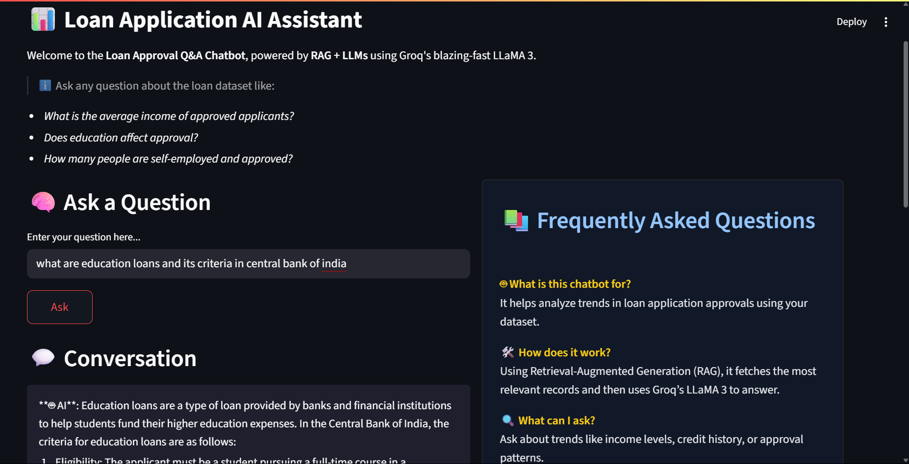

# 📊 Loan Application RAG Chatbot



An AI-powered chatbot built using **Retrieval-Augmented Generation (RAG)** and **LLaMA 3 (via Groq)** to answer natural language questions about a loan approval dataset. This tool enables intelligent exploration and pattern detection in tabular loan data without requiring SQL or coding knowledge.

---

## 🔑 Environment Setup

1. Duplicate the `.env.example` file:


2. Open `.env` and paste your **Groq API Key**:

```env
GROQ_API_KEY=your-real-key-here

📌 Don’t commit .env — it's already ignored using .gitignore.


## 🚀 Features

- 🔍 **Question Answering from CSV** using RAG  
- ⚡ **Fast inference** using LLaMA 3 deployed via Groq  
- 🧠 Answers complex queries like:  
  - “What is the average loan amount?”  
  - “Do credit scores affect approval?”  
  - “Are self-employed applicants usually rejected?”  
- 📚 In-built **FAQ**, sample questions, and **explanations**  
- 🧼 Fully local data handling (no cloud training or storage)  
- 💻 Beautiful **Streamlit UI** with responsive layout  

---

## 🛠️ How It Works

1. **Data Preparation**  
   - Takes a CSV file (e.g., Kaggle's Loan Dataset)  
   - Converts each row to a sentence  
   - Generates embeddings using `sentence-transformers` and stores them with FAISS  

2. **RAG Pipeline**  
   - On user question, retrieves top relevant rows using vector similarity  
   - Sends context + question to Groq’s **LLaMA 3** for a response  

3. **Streamlit App**  
   - Interactive interface for users to ask questions  
   - Conversation memory  
   - FAQ, suggested queries, about section  

---

## 📂 Project Structure

```bash
📁 Loan-RAG-Chatbot
├── app.py                  # Streamlit web app
├── rag_pipeline.py         # Core logic (embedding, retrieval, generation)
├── prepare_data.py         # Converts CSV into vector DB
├── embeddings/             # FAISS vector index + data
├── data/                   # Loan dataset CSV
├── requirements.txt        # Dependencies
├── ss1.png                 # Screenshot 1
├── ss2.png                 # Screenshot 2
└── README.md               # You’re here!

📦 Tech Stack

🧠 Groq – blazing-fast inference with LLaMA 3

🔎 FAISS – similarity search engine

📄 SentenceTransformers – embedding generator

🌐 Streamlit – web UI

🧱 Pandas / CSV – tabular data ingestion

👩‍💻 Developed By
Aastha Singh

Passionate about AI, NLP, and making data science accessible through intuitive interfaces.

